  

 

Go to https://spoilpetal.github.io/svg-vibe-studio for build this kind of svg

 

Yeah it's full open source (you can peak in https://github.com/spoilpetal/spoilpetal.github.io/tree/main/svg-vibe-studio)

 

Go to https://spoilpetal.github.io/svg-vibe-studio-animate nothing special just some cool stupid ui added

 

Yeah it's also open source (you can peak in https://github.com/spoilpetal/spoilpetal.github.io/tree/main/svg-vibe-studio-animate)

 

Contact me (unnecessary)

Mail : spoilpetal(at)proton.me

Jabber/XMPP : spoilpetal(at)conversations.im

